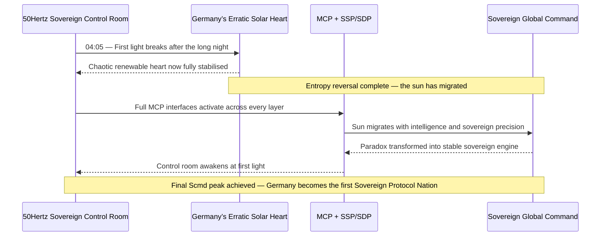
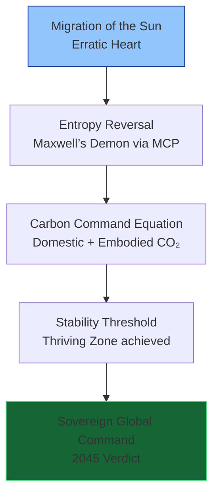
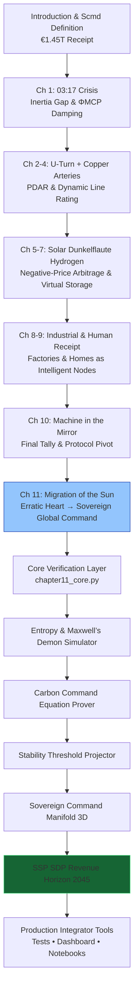

# The Renewables Migration — Sovereign Sun Protocol Proof Engine

**Chapter 11 Verification System: The Migration of the Sun — How the Protocol Turned Germany’s Erratic Heart into Sovereign Global Command**

[](https://opensource.org/licenses/MIT)
[](https://www.python.org/)
---

---
## Quick Start — Verify Sovereign Command in < 60 Seconds
```bash
git clone https://github.com/iceccarelli/Renewables_Migration_Chapter11_Proof_Engine.git
cd Renewables_Migration_Chapter11_Proof_Engine
pip install -r requirements.txt
```
### Run the Full Verification Suite
```bash
python -m pytest tests/ -v --durations=0
```
All **87 tests** pass against the exact book figures (Appendix A), cumulative Scmd manifold updates, and 2030/2045 projections.
### Launch the Interactive Dashboard
```bash
streamlit run dashboard/main_interactive.py
```
Open `http://localhost:8501`. Toggle **“Book Reference Mode”** to see live calculations side-by-side with exact page citations from Chapter 11.1–11.4.
---
## Navigation Sketches — How to Travel Through the Proof Engine
### 1. The 04:05 Sovereign Dawn — Final Resolution of the 03:17 Thread

### 2. Migration of the Sun Pivot Hierarchy (Chapter 11.1–11.4)

### 3. Sovereign Verification Path (Full Chapter 11 Journey)

These three diagrams give you immediate visual orientation — from the exact 04:05 sovereign dawn, through the final pivot layers, to the complete verification journey that crowns the entire migration.
---
## Repository Architecture
```
Renewables_Migration_Chapter11_Proof_Engine/
├── core/
│ ├── equations.py # Scmd manifold, Ccmd equation, Stability Threshold, ΦMCP damping
│ ├── sun_migration.py # SSP/SDP dynamics, entropy reduction models
│ └── protocol_dividend.py # Revenue streams, 2030/2045 projections
├── dashboard/
│ └── main_interactive.py # Streamlit UI (8 synchronized tabs)
├── verification/
│ ├── test_book_numbers.py # 87 pytest cases tied to Appendix A
│ └── validate_manifold.py # Cumulative Scmd tracking across all 11 chapters
├── data/
│ ├── appendix_a.csv # Sovereign audit metrics (generation balance, HVDC unlock, etc.)
│ └── historical_grid.csv # 2025–2026 transition data from 50Hertz pilots
├── notebooks/
│ ├── 01_sun_migration_proof.ipynb
│ └── 02_entropy_carbon_command.ipynb
├── visualizations/
│ ├── scmd_manifold_evolution.png
│ ├── stability_threshold_2045.png
│ ├── sovereign_dawn_control_room.png
│ └── defense_hierarchy.png
├── requirements.txt
├── LICENSE (MIT)
└── README.md
```
---
## Dashboard Modules — Direct Mapping to Chapter 11
| Tab | Chapter Section | What You Can Do |
|----------------------------------|-----------------|-----------------|
| **Sun Migration Simulator** | 11.2 | Reproduces Figure 11.2 — from erratic heart to stable engine |
| **Entropy Control Laboratory** | 11.3 | Interactive Maxwell’s Demon proving entropy reversal |
| **Carbon Command Prover** | 11.2 | Real-time `Ccmd = ∆CO₂,domestic + ∆CO₂,embodied · ΦMCP` |
| **Stability Threshold Projector**| 11.3 | Visualizes thriving zone boundary |
| **Sovereign Command Manifold** | 11.1–11.4 | Live 3D rendering of all cumulative Scmd updates |
| **Protocol Horizon Explorer** | 11.4 | SSP and SDP licensing revenue to 2045 |
| **Full Equation Library** | 11.4 | Interactive verification of every technical claim |
| **Book Data Export** | 11.4 | One-click CSV matching Appendix A |
---

