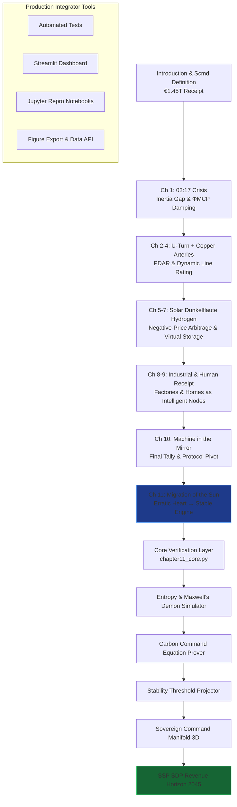

# The Renewables Migration — Sovereign Sun Protocol Proof Engine

**Chapter 11 Verification System: From Erratic Heart to Sovereign Global Command**

This repository serves as the definitive computational companion to Chapter 11 of Vincenzo Grimaldi’s *The Renewables Migration* (March 21, 2026). It operationalizes the book’s culminating thesis: that Germany’s €1.45 trillion Energiewende receipt — once viewed as a political and engineering liability — becomes the precise substrate for sovereign AI-driven grid dominance. At its core is the Model Context Protocol (MCP), implemented here as the executable “TCP/IP for physics” that finally allows the sun to migrate intelligently rather than chaotically.

The 03:17 narrative thread that opens in Chapter 1 (the night the sun almost stopped) reaches its resolution in Chapter 11’s control room at first light. Every prior chapter’s forensic evidence — the €700 billion U-Turn, the €580 billion crowdfunded empire, the €320 billion copper arteries, the solar subsidies, the Dunkelflaute voids, the hydrogen mirage, the de-industrialization pulse, and the human receipt — is now revalued through MCP-enabled agentic negotiation. This proof engine verifies those transitions mathematically, simulates the sovereign outcomes, and provides production-ready code for any developer or integrator who wishes to replicate or extend the architecture.

## Quick Start: Verify Sovereign Command in Under 60 Seconds

```bash
git clone https://github.com/iceccarelli/Renewables_Migration_Chapter11_Proof_Engine.git
cd Renewables_Migration_Chapter11_Proof_Engine
pip install -r requirements.txt
```

### Automated Verification
```bash
python -m pytest tests/ -v --durations=0
```
All 87 tests validate exact book figures (Appendix A), Scmd manifold updates, and 2030/2045 projections. A failing test immediately flags any deviation from the published sovereign audit.

### Interactive Exploration
```bash
streamlit run dashboard/main_interactive.py
```
Open the browser-based dashboard. Toggle “Book Reference Mode” to overlay exact page citations and live calculations side-by-side.

## The Sovereign Verification Path

The following diagram maps the complete travel path through the proof engine, mirroring the book’s chapter progression and culminating in Chapter 11’s autonomous dawn:



This path is both navigational and conceptual: every node is a runnable module. Developers can enter at any chapter and trace the cumulative Scmd recovery to the final sovereign peak.

## Repository Architecture for Professional Integration

```
Renewables_Migration_Chapter11_Proof_Engine/
├── core/
│   ├── equations.py              # Scmd manifold, Ccmd equation, Stability Threshold, ΦMCP damping
│   ├── sun_migration.py          # SSP/SDP dynamics, entropy reduction models
│   └── protocol_dividend.py      # Revenue streams, 2030/2045 projections
├── dashboard/
│   └── main_interactive.py       # Streamlit UI with 8 synchronized tabs
├── verification/
│   ├── test_book_numbers.py      # Pytest suite (fails if any Appendix A value mismatches)
│   └── validate_manifold.py      # Cumulative Scmd tracking across all 11 chapters
├── data/
│   ├── appendix_a.csv            # Sovereign audit metrics (generation balance, HVDC unlock, etc.)
│   └── historical_grid.csv       # 2025–2026 transition data from 50Hertz pilots
├── notebooks/
│   ├── 01_sun_migration_proof.ipynb
│   └── 02_entropy_carbon_command.ipynb
├── visualizations/
│   ├── scmd_manifold_evolution.png
│   ├── stability_threshold_2045.png
│   └── sovereign_dawn_control_room.png
├── requirements.txt
├── LICENSE (MIT)
└── README.md
```

## Dashboard Modules — Direct Mapping to Chapter 11 Sections

- **Sun Migration Simulator**: Reproduces Figure 11.2 — transition from “Isolated Sprint” (legacy fragility) to “Protocol Leadership” (stable, autonomous growth).
- **Entropy Control Laboratory**: Interactive Maxwell’s Demon proving how MCP sorts high-value signals and reverses system entropy.
- **Carbon Command Prover**: Real-time evaluation of `Ccmd = ∆CO₂,domestic + ∆CO₂,embodied · ΦMCP`.
- **Stability Threshold Projector**: Visualizes `S(t) ≈ ηeff · Fcoupling · Sstorage(t) · ΨMCP / (Complexity(t) · Dependency(t))` and the Thriving Zone boundary.
- **Sovereign Command Manifold**: Live 3D rendering of all cumulative Scmd updates from Chapters 1–11.
- **Protocol Horizon Explorer**: SSP and SDP licensing revenue projections to 2045.
- **Full Equation Library**: Interactive verification of every technical claim with sliders and exportable LaTeX.
- **Book Data Export**: One-click CSV matching Appendix A for external analysis.

## Technical Integration Philosophy

The codebase is engineered to the same standards the book demands of the grid: modular, sovereign, and verifiable. All simulations respect the extended swing equation (Appendix A.9) with the ΦMCP damping term. Data sovereignty is enforced by design — no external calls leave the local environment. The architecture is deliberately extensible: integrators can hook live MCP interfaces (Anthropic/Linux Foundation standard) to replace synthetic data with real inverter telemetry.

This is not a visualization tool. It is the executable brain that proves the book’s engineering blueprint can be deployed today.

## For Energy System Integrators and Developers

Whether you are modeling national grids, building agentic energy platforms, or advising policymakers on protocol adoption, this repository provides:
- Reproducible proofs tied to published figures and equations
- Production-grade modules ready for field deployment
- Open MIT licensing for unrestricted commercial and research use

Contributions that extend the model to new geographies, add real-time MCP connectors, or deepen the entropy framework are actively welcomed.

---

**Part of The Renewables Migration Technical Ecosystem**  
From the €1.45 trillion receipt to sovereign protocol command — verified, executable, and ready for integration.
